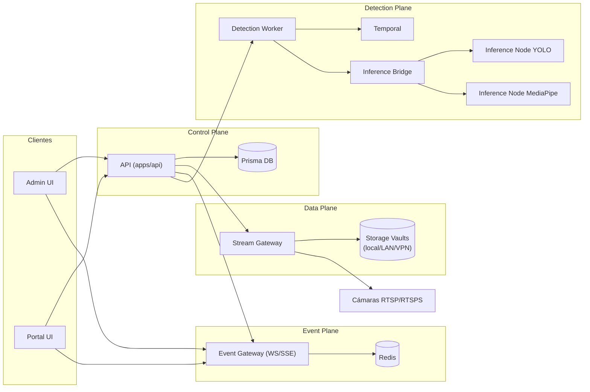

# NearHome POC Monorepo

Monorepo PNPM + Turborepo con:

- `apps/api`: Fastify + Prisma (SQLite local / PostgreSQL staging) control-plane POC
- `apps/stream-gateway`: data-plane MVP para playback (provision + playback tokenizado)
- `apps/event-gateway`: event-plane WS/SSE (token short-lived + tenant scoped)
- `apps/inference-bridge`: FastAPI bridge para seleccionar nodos/proveedores de inferencia
- `apps/audio-detection-runner`: runner TypeScript de detección de audio (sampler/gate/plugins/agregación)
- `apps/detection-worker`: Temporal worker para jobs de detección
- `apps/inference-node-yolo`: nodo de inferencia on-prem (object detection)
- `apps/inference-node-mediapipe`: nodo de inferencia on-prem (pose/actions)
- `apps/admin`: Refine headless + React Router + simple-rest
- `apps/portal`: cliente/monitor con React Router
- `packages/shared`: contratos Zod + tipos compartidos
- `packages/api-client`: fetch client con auth + tenant header
- `packages/ui`: componentes UI (daisyUI + primitive modal estilo shadcn)

## Diagrama del sistema (Mermaid)



Diagrama completo y extendido: `/Users/monotributistar/SOURCES/NearHome/docs/SISTEMA_COMPLETO.md`

## Documentación

### Planificación y arquitectura

- Plan general por etapas: `/Users/monotributistar/SOURCES/NearHome/docs/PLAN_GENERAL.md`
- Diagrama completo del sistema (Mermaid): `/Users/monotributistar/SOURCES/NearHome/docs/SISTEMA_COMPLETO.md`
- Runbook de piloto (local + on-prem): `/Users/monotributistar/SOURCES/NearHome/docs/PILOT_RUNBOOK.md`
- Contratos por componente/interfaz: `/Users/monotributistar/SOURCES/NearHome/docs/CONTRATOS_COMPONENTES.md`
- Contrato ControlPlane/DataPlane: `/Users/monotributistar/SOURCES/NearHome/docs/CONTROLPLANE_DATAPLANE_CONTRACT.md`
- Contrato de seguridad/autenticación de nodos de detección: `/Users/monotributistar/SOURCES/NearHome/docs/NODE_AUTH_CONTRACT.md`
- Contrato de Entitlements: `/Users/monotributistar/SOURCES/NearHome/docs/ENTITLEMENTS_CONTRACT.md`
- Guía de storage vaults (local/LAN/VPN): `/Users/monotributistar/SOURCES/NearHome/docs/STORAGE_VAULTS.md`
- Plan de evolución a streaming sólido (TDD): `/Users/monotributistar/SOURCES/NearHome/docs/PLAN_STREAMING_TDD.md`
- Backlog ejecutable (issues locales): `/Users/monotributistar/SOURCES/NearHome/docs/BACKLOG.md`
- Changelog de contratos API: `/Users/monotributistar/SOURCES/NearHome/docs/API_CHANGELOG.md`
- Sprint actual: `/Users/monotributistar/SOURCES/NearHome/docs/SPRINT_01.md`
- Orden de ejecución recomendado: `/Users/monotributistar/SOURCES/NearHome/docs/EXECUTION_ORDER.md`
- Progreso + cambios + problemas por etapa: `/Users/monotributistar/SOURCES/NearHome/docs/PROGRESO.md`
- Staging PostgreSQL (NH-019): `/Users/monotributistar/SOURCES/NearHome/docs/POSTGRES_STAGING.md`

### Calidad y validación

- Cobertura de casos E2E y alcance por suite: `/Users/monotributistar/SOURCES/NearHome/docs/E2E.md`
- Inventario de pruebas y comandos: `/Users/monotributistar/SOURCES/NearHome/docs/TESTS.md`

## Requisitos

- Node.js 20+
- pnpm 9+

## Setup

1. Bootstrap automático (recomendado):

```bash
pnpm bootstrap
```

2. Setup manual:

```bash
pnpm i
```

3. Variables de entorno:

```bash
cp apps/api/.env.example apps/api/.env
cp apps/stream-gateway/.env.example apps/stream-gateway/.env
cp apps/event-gateway/.env.example apps/event-gateway/.env
cp apps/admin/.env.example apps/admin/.env
cp apps/portal/.env.example apps/portal/.env
```

4. Reset DB + seed:

```bash
pnpm db:reset
```

5. Levantar todo:

```bash
pnpm dev
```

## URLs dev

- API: `http://localhost:3001`
- Stream gateway: `http://localhost:3010`
- Stream gateway metrics: `http://localhost:3010/metrics`
- Event gateway: `http://localhost:3011`
- Inference bridge: `http://localhost:8090`
- Audio detection runner: `http://localhost:8074`
- Inference node YOLO: `http://localhost:8091`
- Inference node MediaPipe: `http://localhost:8092`
- Admin: `http://localhost:5173`
- Portal: `http://localhost:5174`

## Storage y Recording (estado actual)

El `stream-gateway` ya soporta políticas por cámara enviadas desde API (`/cameras/:id/stream-token` -> `/provision`):

- `recordingMode=continuous`: grabación continua en vault + playback HLS.
- `recordingMode=event_only`: sin estrategia de continuo funcional dedicada todavía; hoy se usa pipeline base y clips por evento.
- `recordingMode=hybrid`: continuo + clips por evento.
- `recordingMode=observe_only`: modo observación, sin escribir segmentos al vault (usa scratch efímero local y se limpia al deprovisionar).

Parámetros de clip por evento:

- `eventClipPreSeconds` (default `5`)
- `eventClipPostSeconds` (default `10`)

Endpoints relevantes:

- API:
  - `GET /cameras/:id/event-clips`
  - `POST /cameras/:id/event-clips`
- Stream gateway:
  - `POST /events/clip`
  - `GET /events/clips`
  - `GET /playback/events/:tenantId/:cameraId/:eventId/index.m3u8`

Notas operativas:

- En `observe_only` los clips de evento están deshabilitados (`EVENT_CLIP_DISABLED_IN_OBSERVE_ONLY`).
- El scratch efímero se configura con `STREAM_OBSERVE_SCRATCH_DIR` (default `/tmp/nearhome-observe`).
- El detalle de vaults local/LAN/VPN está en: `/Users/monotributistar/SOURCES/NearHome/docs/STORAGE_VAULTS.md`

## Usuarios seed (password: `demo1234`)

- `admin@nearhome.dev` (`tenant_admin` en tenant A, B y C)
- `monitor@nearhome.dev` (`monitor` en tenant A)
- `client@nearhome.dev` (`client_user` en tenant A)

## Comandos DX

- `pnpm bootstrap`
- `pnpm run setup`
- `pnpm dev`
- `pnpm dev:stream`
- `pnpm dev:event`
- `pnpm dev:audio-detection`
- `pnpm db:reset`
- `pnpm typecheck`
- `pnpm build`
- `pnpm test:e2e`
- `pnpm test:e2e:admin`
- `pnpm test:e2e:portal`
- `pnpm test:stream`
- `pnpm test:stream:load`
- `pnpm test:stream:soak`
- `pnpm test:stream:soak:record`
- `pnpm dev:stack:up`
- `pnpm dev:stack:down`
- `pnpm staging:stack:up:postgres`
- `pnpm staging:stack:down:postgres`
- `pnpm pilot:stack:up:local`
- `pnpm pilot:stack:up:onprem`
- `pnpm pilot:stack:up:onprem:tunnel`
- `pnpm pilot:stack:down:local`
- `pnpm pilot:stack:down:onprem`
- `pnpm pilot:smoke`
- `pnpm pilot:harness:prepare`
- `pnpm pilot:harness:run`
- `pnpm pilot:harness:cleanup`
- `pnpm pilot:harness`
- `pnpm pilot:harness:mock`
- `pnpm pilot:harness:lan`

Reportes soak:

- `docs/reports/stream-soak-latest.md`: último run
- `docs/reports/history/<runId>.md` + `<runId>.json`: historial por corrida
- `docs/reports/stream-soak-history.md`: índice de corridas y deltas vs run previo

## Estado

POC funcional orientado a control-plane + data-plane de playback tokenizado con:

- selección de vault por plan/default (y failover entre vaults sanos),
- retención por tiempo + presión de disco + cuota por tenant,
- métricas de storage/playback,
- políticas de recording por cámara (incluye `observe_only`),
- clips por evento con reproducción HLS de clip.

Streaming productivo de baja latencia hard real-time y evolución del pipeline de detección siguen en etapas siguientes.

Nota: `STREAM_TOKEN_SECRET` debe coincidir entre `apps/api` y `apps/stream-gateway` para validar playback.
Nota: el sync automático de health en API se controla con `STREAM_HEALTH_SYNC_ENABLED`, `STREAM_HEALTH_SYNC_INTERVAL_MS` y `STREAM_HEALTH_SYNC_BATCH_SIZE`.
Nota: el pipeline de detección v1 se activa en API cuando `DETECTION_BRIDGE_URL` está configurado (modo `DETECTION_EXECUTION_MODE=inline`).
Nota: para modo `DETECTION_EXECUTION_MODE=temporal`, API despacha workflows vía `DETECTION_TEMPORAL_DISPATCH_URL` (`/v1/workflows/detection-jobs`).
Nota: el worker reporta resultado/falla a API vía callbacks internos protegidos con `DETECTION_CALLBACK_SECRET`.
Nota: API publica eventos realtime en `event-gateway` vía `EVENT_GATEWAY_URL` + `EVENT_PUBLISH_SECRET` (`POST /internal/events/publish`).

## Detection Plane / Infra On-Prem

- Compose stack: `infra/docker-compose.yml`
- Levantar servicios: `pnpm dev:stack:up`
- Bajar servicios: `pnpm dev:stack:down`
- On-prem local (piloto): `pnpm pilot:stack:up:onprem`
- On-prem con túnel/VPN: `pnpm pilot:stack:up:onprem:tunnel`
- Bajar on-prem: `pnpm pilot:stack:down:onprem`
- Incluye:
  - control-plane (`api`)
  - stream-gateway
  - event-gateway (WS/SSE)
  - inference-bridge
  - audio-detection-runner
  - detection-worker (Temporal)
  - detection-dispatcher (HTTP -> Temporal start workflow)
  - nodos de inferencia on-prem (YOLO/MediaPipe)
  - Temporal + UI
  - Redis
  - observability opcional (Prometheus/Grafana con profile `observability`)

Event-gateway:

- Publish interno: `POST /internal/events/publish` (header `x-event-publish-secret`)
- SSE: `GET /events/stream` con `X-Tenant-Id`
- Replay SSE: `GET /events/stream?replay=20&topics=incident,detection&once=1`
- Frontends (Admin/Portal): configurar `VITE_EVENT_GATEWAY_URL` para realtime WS/SSE (`/ws`, `/events/stream`).
