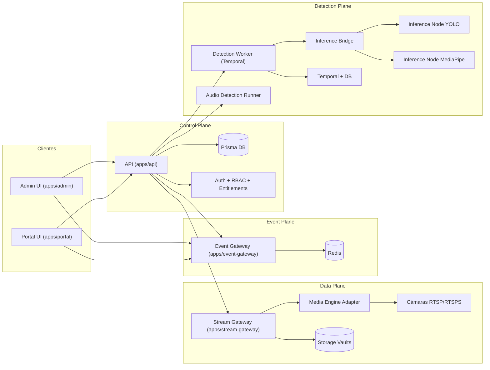
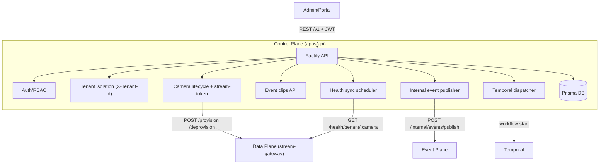
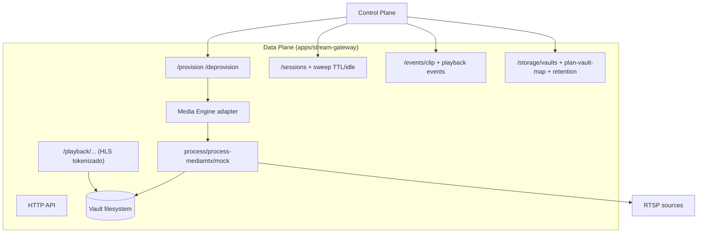
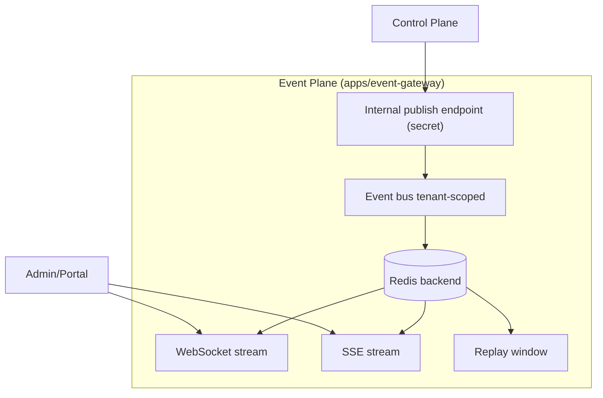
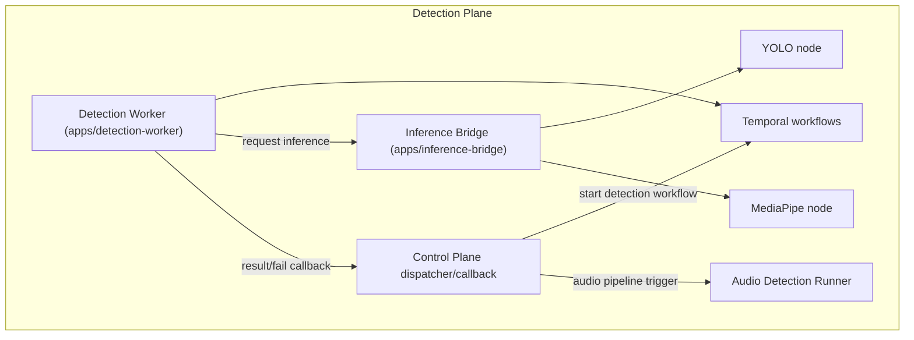

# Diagramas Mermaid por Plane

Fecha de corte: `2026-04-04`

## Sistema general

```mermaid
flowchart LR
  subgraph Clients["Clientes"]
    Admin["Admin UI (apps/admin)"]
    Portal["Portal UI (apps/portal)"]
  end

  subgraph Control["Control Plane"]
    API["API (apps/api)"]
    DB[("Prisma DB")]
    Auth["Auth + RBAC + Entitlements"]
  end

  subgraph Data["Data Plane"]
    SG["Stream Gateway (apps/stream-gateway)"]
    Engine["Media Engine Adapter"]
    Vault[("Storage Vaults")]
    Cam["Cámaras RTSP/RTSPS"]
  end

  subgraph Event["Event Plane"]
    EG["Event Gateway (apps/event-gateway)"]
    Redis[("Redis")]
  end

  subgraph Detect["Detection Plane"]
    Worker["Detection Worker (Temporal)"]
    Bridge["Inference Bridge"]
    NodeY["Inference Node YOLO"]
    NodeM["Inference Node MediaPipe"]
    Temporal["Temporal + DB"]
    Audio["Audio Detection Runner"]
  end

  Admin --> API
  Portal --> API
  Admin --> EG
  Portal --> EG

  API --> DB
  API --> Auth
  API --> SG
  API --> EG
  API --> Worker

  SG --> Engine
  Engine --> Cam
  SG --> Vault

  EG --> Redis

  Worker --> Temporal
  Worker --> Bridge
  Bridge --> NodeY
  Bridge --> NodeM
  API --> Audio
```

## Control Plane (detalle)

```mermaid
flowchart TB
  subgraph Control["Control Plane (apps/api)"]
    API["Fastify API"]
    RBAC["Auth/RBAC"]
    TEN["Tenant isolation (X-Tenant-Id)"]
    CAM["Camera lifecycle + stream-token"]
    CLIPS["Event clips API"]
    SYNC["Health sync scheduler"]
    PUB["Internal event publisher"]
    DISP["Temporal dispatcher"]
    DB[("Prisma DB")]
  end

  UI["Admin/Portal"] -->|"REST /v1 + JWT"| API
  API --> RBAC
  API --> TEN
  API --> CAM
  API --> CLIPS
  API --> SYNC
  API --> PUB
  API --> DISP
  API --> DB

  CAM -->|"POST /provision /deprovision"| SG["Data Plane (stream-gateway)"]
  SYNC -->|"GET /health/:tenant/:camera"| SG
  PUB -->|"POST /internal/events/publish"| EG["Event Plane"]
  DISP -->|"workflow start"| TEMP["Temporal"]
```

## Data Plane (detalle)

```mermaid
flowchart TB
  subgraph Data["Data Plane (apps/stream-gateway)"]
    HTTP["HTTP API"]
    PROV["/provision /deprovision"]
    PLAY["/playback/... (HLS tokenizado)"]
    SESS["/sessions + sweep TTL/idle"]
    ECLIP["/events/clip + playback events"]
    STOR["/storage/vaults + plan-vault-map + retention"]
    ME["Media Engine adapter"]
    PROC["process/process-mediamtx/mock"]
    FS[("Vault filesystem")]
  end

  CP["Control Plane"] --> PROV
  CP --> SESS
  CP --> ECLIP
  CP --> STOR

  PROV --> ME
  ME --> PROC
  PROC --> CAM["RTSP sources"]
  PROC --> FS
  PLAY --> FS
```

## Event Plane (detalle)

```mermaid
flowchart TB
  subgraph Event["Event Plane (apps/event-gateway)"]
    IN["Internal publish endpoint (secret)"]
    BUS["Event bus tenant-scoped"]
    WS["WebSocket stream"]
    SSE["SSE stream"]
    REPLAY["Replay window"]
    REDIS[("Redis backend")]
  end

  API["Control Plane"] --> IN
  IN --> BUS
  BUS --> REDIS
  REDIS --> WS
  REDIS --> SSE
  REDIS --> REPLAY

  UI["Admin/Portal"] --> WS
  UI --> SSE
```

## Detection Plane (detalle)

```mermaid
flowchart TB
  subgraph Detection["Detection Plane"]
    API["Control Plane dispatcher/callback"]
    WORK["Detection Worker (apps/detection-worker)"]
    TEMP["Temporal workflows"]
    BR["Inference Bridge (apps/inference-bridge)"]
    Y["YOLO node"]
    M["MediaPipe node"]
    A["Audio Detection Runner"]
  end

  API -->|"start detection workflow"| TEMP
  WORK --> TEMP
  WORK -->|"request inference"| BR
  BR --> Y
  BR --> M
  WORK -->|"result/fail callback"| API
  API -->|"audio pipeline trigger"| A
```
